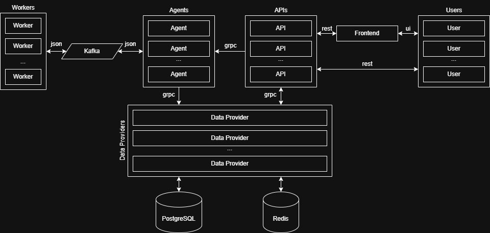
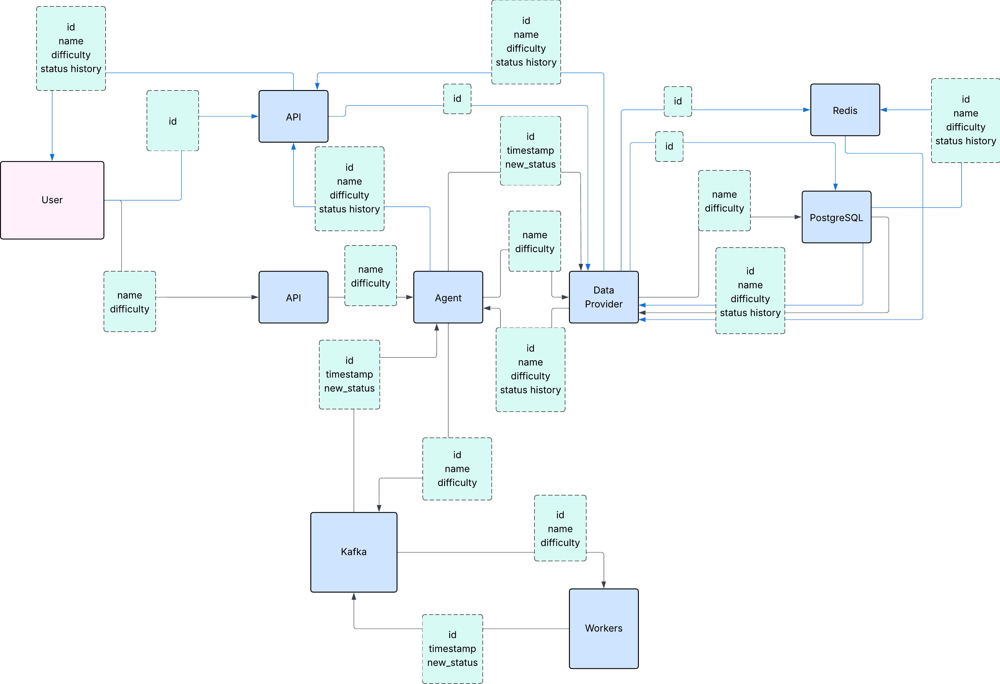
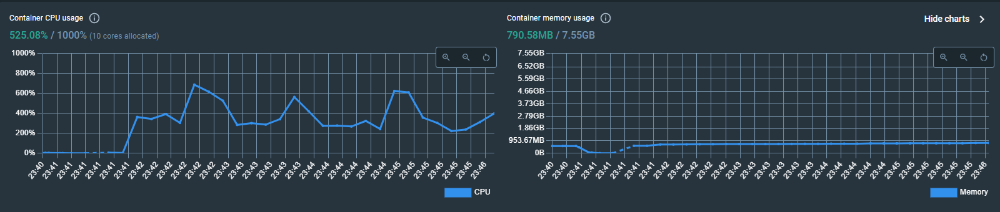
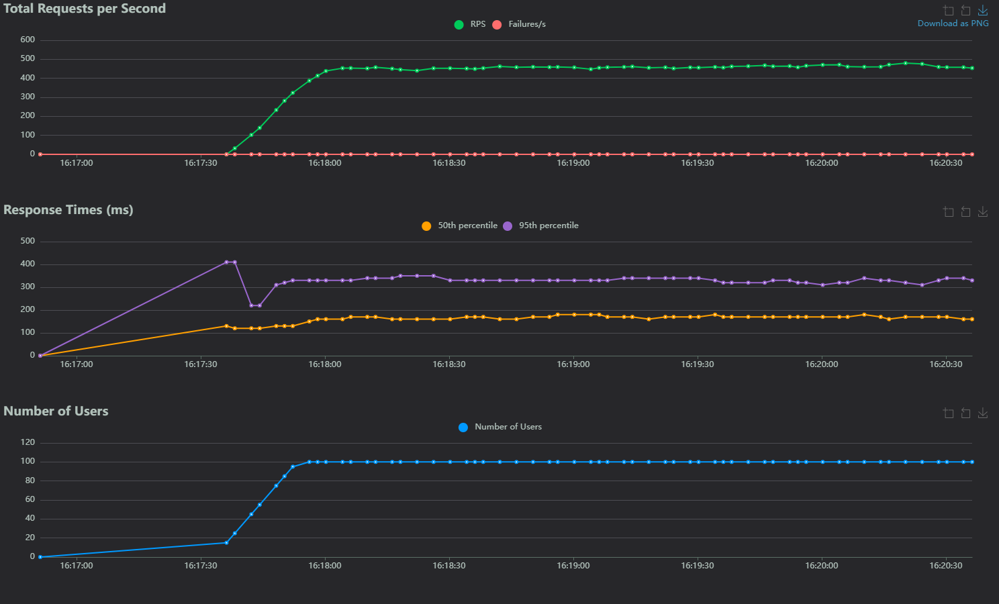

# Отчёт о проделанной работе (ДЗ №1)
Участники
- Бергман Валерий
- Больщиков Константин
- Боярников Александр
- Боярников Евгений
- Проводов Арсений
- Шинкаренко Андрей

## Приложение

Актуальные ссылки на [на
UI](https://bergman-task-resolver-web-ui.mfti.devops-teta.ru/), [на
API](https://bergman-task-resolver-api.mfti.devops-teta.ru/).

### Overview
Task Resolver - приложение, эмулирующее выполнение задач. Пользователь создаёт задачу, указывая название и сложность
(easy, medium, hard), после чего приложение делает вид, что выполняет его (засыпает на некоторое время). 
Пользователь может проверять состояние задачи и просматривать список со всеми задачами по страницам.

### Github репозиторий
Ссылка на git https://github.com/5krotov/task-resolver  
Структура репозитория построена по принципу модульной архитектуры, где каждый сервис размещён в отдельном репозитории,
а все они подключаются в один основной репозиторий в виде git-сабмодулей.

## Отчёт о scrum-митингах
Ссылка на отчёт:
https://docs.google.com/spreadsheets/d/18Srbdpoj6jT0sGQIJYDf65EfFI_p-OfnlpoB7-fKIco/edit?usp=sharing

## Архитектура
### Структура

Приложение состоит из следующих микросервисов:
- **web-ui** - инкапсулирует работу с ui
- **worker-service** - инкапсулирует выполнение нагрузки
- **agent-service** - инкапсулирует работу с kafka
- **data-provider** - инкапсулирует работу с данными
- **api-service** - инкапсулирует работу с api
- *[сторонний]* **kafka** -  буфер между сервисами, обеспечивает "глупость" worker-service
- *[сторонний]* **postgres** - основное хранилище данных
- *[сторонний]* **redis** - кэш запросов

### Схема архитектуры

### Схема датафлоу

## IDR

----

### Архитектура

#### Выбор:
Варианты:
- Монолитная архитектура
- Микросервисная архитектура
- Гибридный подход (микросервисы + модульный монолит)

**Выбранное решение:** *Микросервисная архитектура*

#### Обоснование:
- Позволяет независимо масштабировать компоненты через Kubernetes
- Упрощает разработку и развертывание отдельных частей системы
- Повышает отказоустойчивость
- Позволяет использовать разные технологии для разных задач
- Соответствует требованиям к гибкости и масштабируемости

#### Негативные последствия:
1. Увеличивается сложность оркестрации сервисов.  
**Решение:** *Используем Kubernetes*

2. Требуется дополнительная инфраструктура для мониторинга.  
**Решение:** *Используем Helm для Prometheus + Grafana*

3. Возрастают накладные расходы на межсервисное взаимодействие  
**Решение:** *Используем GPRC* 
**Рост:** в MVP gprc зависти не успели хотя оно здесь смотрится очень хорошо - точка для роста

----

### Микросервисы

#### Обоснование:
- Разделение ответственности: каждый сервис решает одну задачу
- Изоляция изменений: модификация UI не затрагивает обработку данных
- Гибкость масштабирования: worker-service можно масштабировать независимо от API
- Упрощение разработки: команды могут работать над разными сервисами параллельно
- "Глупость" worker-service: делает его более надежным и простым в поддержке

#### Негативные последствия:

1. Увеличивается количество точек взаимодействия, проблемы с поддержанием api.  
   **Решение:** *Используем внешний пакет с версионированием общих структур и api*  
   **Рост:** *Используем протобафы*

----

### База данных
#### Выбор:
Варианты:
- PostgreSQL
- MongoDB
- MySQL

**Выбранное решение:** *PostgreSQL*

#### Обоснование:
- Реляционный
- Быстрый
- Open Source
- Транзакции для консистентности запросов
- Поддержка репликации

----

### Кэш
#### Выбор:
Варианты:
- Redis
- In-memory

**Выбранное решение:** *Redis*

#### Обоснование:
- Экстремально быстрое время отклика для кэшированных запросов
- Поддержка хэшей
- Возможность persistence при необходимости
- Широкие возможности кластеризации

#### Негативные последствия:
1. Требуется дополнительная инфраструктура  
   **Решение:** *Используем Kubernetes*

----

### Брокер
#### Выбор:
Варианты:
- Kafka
- RabbitMQ

**Выбранное решение:** *Kafka*

#### Обоснование:
- Гарантированная доставка сообщений
- Высокая пропускная способность
- Поддержка потоковой обработки
- Возможность повторной обработки сообщений
- Горизонтальная масштабируемость
- Отказоустойчивость и надежность
- Разделение producer и consumer (worker-service остается "глупым")

#### Негативные последствия:
1. Требуется дополнительная инфраструктура  
   **Решение:** *Используем Kubernetes*
2. Необходимо управлять партициями и топиками  
   **Решение:** *Используем библиотеки*

----

## Нагрузочное тестирование

### Метрики

### Нагрузка

### RPS

### Анализ
#### Узкие места:
- REST: json в среднем медленнее бинарных protobuf и при этом держит типизацию только через схемы.
  Постоянное налаживание соединений существенно медленнее поддержания сокета.
