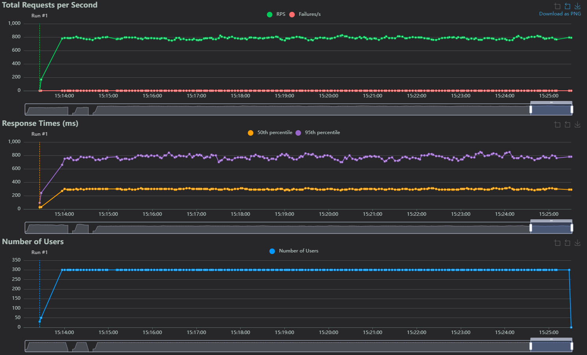

# Отчёт о проделанной работе (ДЗ №2)
Участники
- Бергман Валерий
- Больщиков Константин
- Боярников Александр
- Боярников Евгений
- Проводов Арсений
- Шинкаренко Андрей

## Приложение

### Overview
Task Resolver - приложение, эмулирующее выполнение задач. Пользователь создаёт задачу, указывая название и сложность
(easy, medium, hard), после чего приложение делает вид, что выполняет его (засыпает на некоторое время). 
Пользователь может проверять состояние задачи и просматривать список со всеми задачами по страницам.

### Деплой

Приложение развёрнуто в Kubernetes-кластере. [WebUI](https://bergman-task-resolver-web-ui.mfti.devops-teta.ru/),
[API](https://bergman-task-resolver-api.mfti.devops-teta.ru/)
и [дашборды Grafana](https://bergman-task-resolver-grafana.mfti.devops-teta.ru/) доступны по соответствующим ссылкам.

Каждый из микросервисов собирается в докер-образ и загружается в [Harbor registry](https://harbor.devops-teta.ru/harbor/projects/80/repositories).
Оттуда он становится доступен Kubernetes-кластеру, имеющему harbor secret.

Выписка сертификатов для внутреннего взаимодействия по TLS производится на начальном этапе и представляется Job.
Под запускается на основе докер-образа сервиса и сохраняет сертификаты в PVC certs.
Затем для кластера создаётся cluster issuer, который выписывает Lets Encrypt сертификаты для публичных эндпоинтов приложения (web, grafana, api).

Микросервисы представлены реплицированными (от 1 до 3) подами Deployment.
В них пробрасывается PVC certs и требуемые ConfigMap.
Доступ к подам осуществляется через Service, публичные эндпоинты открываются с помощью Ingress.

Prometheus и Grafana — средства мониторинга — раздеплоены с помощью helm-чартов в отдельном неймспейсе

[Ссылка на репозиторий infra со всеми манифестами](https://github.com/5krotov/task-resolver-infra)

### Github репозиторий
Структура репозитория построена по принципу модульной архитектуры, где каждый сервис размещён в отдельном репозитории,
а все они подключаются в один основной репозиторий в виде git-сабмодулей.

[**Основной репозиторий**](https://github.com/5krotov/task-resolver)  
Сабмодули:
- [**web-ui**](https://github.com/5krotov/task-resolver-web-ui) - репозиторий frontend
- [**worker-service**](https://github.com/5krotov/task-resolver-worker-service) - репозиторий микросервиса worker-service
- [**agent-service**](https://github.com/5krotov/task-resolver-agent-service) - репозиторий микросервиса agent-service
- [**data-provider**](https://github.com/5krotov/task-resolver-data-provider-service) - репозиторий микросервиса data-provider-service
- [**api-service**](https://github.com/5krotov/task-resolver-api-service) - репозиторий микросервиса api-service
- [**performance-test**](https://github.com/5krotov/task-resolver-performance-test) - репозиторий скриптов нагрузочного тестирования
- [**certificate-generator**](https://github.com/5krotov/task-resolver-certificate-generator) - репозиторий приложения, отвечающего за выдачу сертификатов.
- [**infra**](https://github.com/5krotov/task-resolver-infra) - репозиторий инфраструктурных фич. (kubernetes, автоматика и др.)
- [**pkg**](https://github.com/5krotov/task-resolver-pkg) - репозиторий для общих ресурсов.

## Отчёты о scrum-митингах
[Ссылка на отчёт о scrum-митингах по дз1 (google spreadsheets)](https://docs.google.com/spreadsheets/d/18Srbdpoj6jT0sGQIJYDf65EfFI_p-OfnlpoB7-fKIco/edit?usp=sharing)  
[Ссылка на отчёт о scrum-митингах по дз2 (google spreadsheets)](https://docs.google.com/spreadsheets/d/1WTzIahLYUnJwL8pLhGHc7-6uLpzgGjLxivdqbHdoXPI/edit?usp=sharing)

## Архитектура

### Разбиение монолита на микросервисы
Разбиение монолита на микросервисы происходило в соответствии с выбранными модулями:
Worker, Agent, Api, Data Provider.  
Такое разбиение обусловлено, модульностью и обеспечивает следующие приемущества:
- ***Инкапсуляция.*** Каждый микросервис отвечает за свою область:  
  API - принимает запросы,  
  Agent - создаёт и контролирует задачи,  
  Worker - "решает" задачи,  
  Data Provider - работает с данными.  
  *Инкапсуляция делает код каждого из микросервисов проще.*
- ***Независимая репликация.*** Каждый микросервис может быть реплицирован необходимое
  различное количество раз в соответствии с нагрузкой.

### Структура
Приложение состоит из следующих микросервисов:
- **web-ui** - инкапсулирует работу с ui
- **worker-service**- инкапсулирует выполнение нагрузки
- **agent-service** - инкапсулирует работу с kafka
- **data-provider** - инкапсулирует работу с данными
- **api-service** - инкапсулирует работу с api
- *[сторонний]* **kafka** -  буфер между сервисами, обеспечивает "глупость" worker-service
- *[сторонний]* **postgres** - основное хранилище данных
- *[сторонний]* **redis** - кэш запросов

***Общение между микросервисами реализовано через GRPC и с использованием Kafka.
Общение с frontend и пользователем — через REST.***

#### Схема архитектуры

#### Схема последовательности вызовов
create_task:  
  

get_task:  

### Выборы в контексте IDR

*добавлен "Request-Response взаимодействия сервисов"*

----

#### Архитектура

**Варианты:**
- Монолитная архитектура
- Микросервисная архитектура
- Гибридный подход (микросервисы + модульный монолит)

**Выбранное решение:** *Микросервисная архитектура*

**Обоснование:**
- Позволяет независимо масштабировать компоненты через Kubernetes
- Упрощает разработку и развертывание отдельных частей системы
- Повышает отказоустойчивость
- Позволяет использовать разные технологии для разных задач
- Соответствует требованиям к гибкости и масштабируемости

**Негативные последствия:**
1. Увеличивается сложность оркестрации сервисов.  
**Решение:** *Используем Kubernetes*

2. Требуется дополнительная инфраструктура для мониторинга.  
**Решение:** *Используем Helm для Prometheus + Grafana*

3. Возрастают накладные расходы на межсервисное взаимодействие  
**Решение:** *Используем GPRC* 
----

#### Request-Response взаиодействия сервисов

**Варианты:**
- REST/HTTP
- gRPC
- GraphQL

**Выбранное решение:** *gRPC*

**Обоснование:**
- Производительность: бинарный protobuf в 5-10x быстрее JSON.
- Безопасность: встроенный поддержка TLS для шифрования и аутентификации сервисов +
возможность интеграции с mTLS для взаимной верификации.
- Консистентность API: генерация кода из .proto-файлов гарантирует консистентность.
- Межъязыковая совместимость: единый API для сервисов на разных языках, улучшает расширяемость.

**Негативные последствия:**

1. Сложность отладки
    - Бинарный формат сообщений требует дополнительных инструментов.  
   **Решение:** *использовать, grpcurl*
2. Статическая типизация
    - Изменение `.proto`-файлов требует перегенерации кода  
      **Решение:** *Версионирование proto-контрактов в отдельном репозитории*
----

#### База данных
**Варианты:**
- PostgreSQL
- MongoDB
- MySQL

**Выбранное решение:** *PostgreSQL*

**Обоснование:**
- Реляционный
- Быстрый
- Open Source
- Транзакции для консистентности запросов
- Поддержка репликации

----

#### Кэш
**Варианты:**
- Redis
- In-memory

**Выбранное решение:** *Redis*

**Обоснование:**
- Экстремально быстрое время отклика для кэшированных запросов
- Поддержка хэшей
- Возможность persistence при необходимости
- Широкие возможности кластеризации

**Негативные последствия:**
1. Требуется дополнительная инфраструктура  
   **Решение:** *Используем Kubernetes*

----

#### Брокер
**Варианты:**
- Kafka
- RabbitMQ

**Выбранное решение:** *Kafka*

**Обоснование:**
- Гарантированная доставка сообщений
- Высокая пропускная способность
- Поддержка потоковой обработки
- Возможность повторной обработки сообщений
- Горизонтальная масштабируемость
- Отказоустойчивость и надежность
- Разделение producer и consumer (worker-service остается "глупым")

**Негативные последствия:**
1. Требуется дополнительная инфраструктура  
   **Решение:** *Используем Kubernetes*
2. Необходимо управлять партициями и топиками  
   **Решение:** *Используем библиотеки*

----

## Нагрузочное тестирование

### Метрики

### Динамика тестирования (RPS, RT, NoU)

### Нагрузка на кластер (GRAFANA)
Нагрузка CPU

Нагрузка RAM

### Оценка
Система демонстрирует высокую стабильность при большом количестве запросов, все запросы завершаются корректно.  
На графике кажется, что Worker сервисы нагружаются слабо, однако это связано со спецификой сервиса: основной функционал — sleep,
из-за чего и получается такая картина, хотя сервисы не простаивают и фактически являются наиболее нагруженными.  
Kafka отлично обеспечивает буфер между Worker и Agent сервисами, не позволяя Agent сервисам перегружать Worker.
Решение отлично масштабируется, что продемонстрировано на Agent, Worker и Api сервисах.